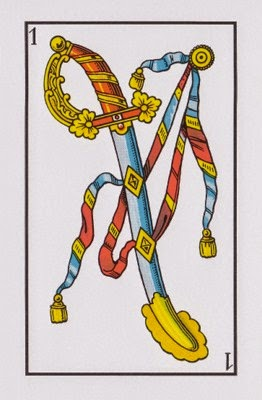

# Truco Backend [WIP]



This Repo is a simple backend for the game [Truco](https://en.wikipedia.org/wiki/Truco) written in [go](https://golang.org/).

## Endpoints and Documentation

### `GET/newGame`

Starts a new game and builds a deck

#### Response

```
{
    "Board": [],
    "Players": [],
    "Deck": [
        {
            "value": 1,
            "house": "gold"
        },
        {
            "value": 1,
            "house": "cups"
        },
        {
            "value": 1,
            "house": "spades"
        },
        {
            "value": 1,
            "house": "clubs"
        },
        {
            "value": 2,
            "house": "gold"
        },
        {
            "value": 2,
            "house": "cups"
        },
        {
            "value": 2,
            "house": "spades"
        },
        {
            "value": 2,
            "house": "clubs"
        },
        {
            "value": 3,
            "house": "gold"
        },
        {
            "value": 3,
            "house": "cups"
        },
        {
            "value": 3,
            "house": "spades"
        },
        {
            "value": 3,
            "house": "clubs"
        },
        {
            "value": 4,
            "house": "gold"
        },
        {
            "value": 4,
            "house": "cups"
        },
        {
            "value": 4,
            "house": "spades"
        },
        {
            "value": 4,
            "house": "clubs"
        },
        {
            "value": 5,
            "house": "gold"
        },
        {
            "value": 5,
            "house": "cups"
        },
        {
            "value": 5,
            "house": "spades"
        },
        {
            "value": 5,
            "house": "clubs"
        },
        {
            "value": 6,
            "house": "gold"
        },
        {
            "value": 6,
            "house": "cups"
        },
        {
            "value": 6,
            "house": "spades"
        },
        {
            "value": 6,
            "house": "clubs"
        },
        {
            "value": 7,
            "house": "gold"
        },
        {
            "value": 7,
            "house": "cups"
        },
        {
            "value": 7,
            "house": "spades"
        },
        {
            "value": 7,
            "house": "clubs"
        },
        {
            "value": 10,
            "house": "gold"
        },
        {
            "value": 10,
            "house": "cups"
        },
        {
            "value": 10,
            "house": "spades"
        },
        {
            "value": 10,
            "house": "clubs"
        },
        {
            "value": 11,
            "house": "gold"
        },
        {
            "value": 11,
            "house": "cups"
        },
        {
            "value": 11,
            "house": "spades"
        },
        {
            "value": 11,
            "house": "clubs"
        },
        {
            "value": 12,
            "house": "gold"
        },
        {
            "value": 12,
            "house": "cups"
        },
        {
            "value": 12,
            "house": "spades"
        },
        {
            "value": 12,
            "house": "clubs"
        }
    ]
}
```

### `POST /addPlayer`

Adds a player to the game

#### Request

```
{
	"name": "my player's name"
}
```

#### Response

```
{
    "PlayerState": {
        "Info": {
            "Name": "boris",
            "ID": "player_boris"
        },
        "Hand": [
            {
                "value": 1,
                "house": "clubs"
            },
            {
                "value": 2,
                "house": "gold"
            },
            {
                "value": 2,
                "house": "cups"
            }
        ]
    },
    "Board": []
}
```

### `POST /player`

Gets information on a given player

#### Request

```
{
	"playerId": "player_boris"
}
```

#### Response

```
{
    "PlayerState": {
        "Info": {
            "Name": "boris",
            "ID": "player_boris"
        },
        "Hand": [
            {
                "value": 1,
                "house": "cups"
            },
            {
                "value": 2,
                "house": "gold"
            },
            {
                "value": 2,
                "house": "cups"
            },
        ]
    },
    "Board": []
}
```

### `POST /playCard`

Gets information on a given player

#### Request

```
{
	"ID" : "player_boris",
	"card": {
		"value": 1, "house": "cups"
	}
}
```

#### Response

```
{
    "PlayerState": {
        "Info": {
            "Name": "boris",
            "ID": "player_boris"
        },
        "Hand": [
            {
                "value": 2,
                "house": "gold"
            },
            {
                "value": 2,
                "house": "cups"
            },
        ]
    },
    "Board": [
            {
                "value": 1,
                "house": "cups"
            }
    ]
}
```

## ToDo

Quite a lot. WIP!